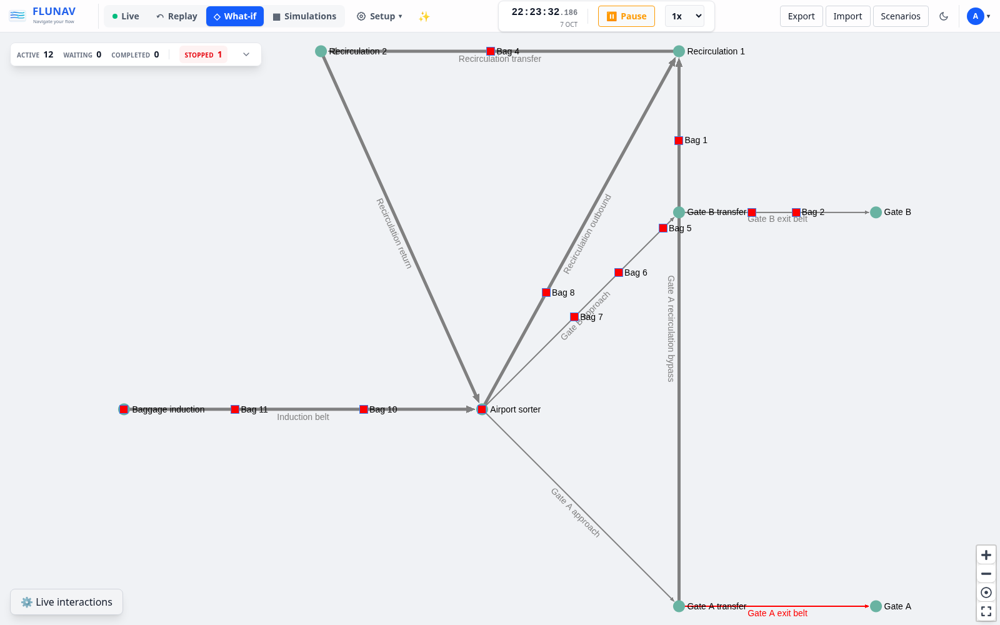
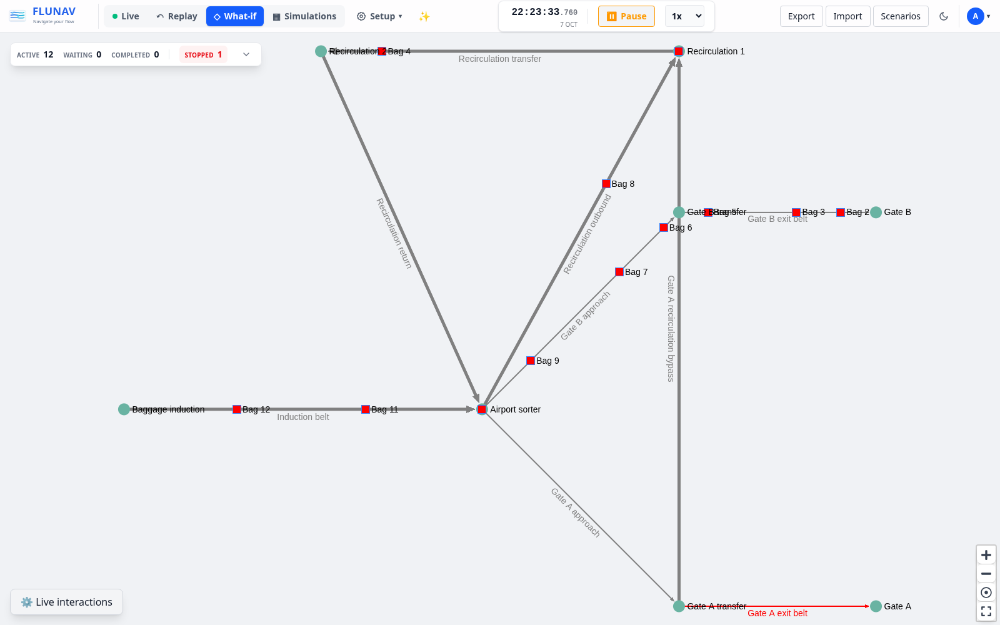

<p align="center">
  
</p>

# Flunav

Flunav is a digital twin for conveyor and sorting systems: a virtual view of a facility that shows how items move, helps explain past problems, and lets you explore changes before trying them in the real world.



## Main features

- **Live:** Follow items in real time, monitor conveyor status, and spot queues, bottlenecks, and alarms.
- **Simulation:** Replay past activity or jump into the future to see the system's predicted state. Pause, resume, and slow down or speed up playback to inspect the flow at your own pace.
- **What If:** Try changes to the layout, conveyor speeds, or routing rules in a separate scenario without affecting the live system.
- **Multi-simulation:** Run repeated experiments with different item arrivals and conveyor failures, then compare results to understand performance and variability.
- **Routing logic:** Decide where items should go with destination rules based on their attributes, and use priorities to balance faster delivery with available capacity.
- **Anomaly detection:** Automatically flag unusual item movement and flow patterns to help identify operational problems.
- **AI assistant:** Ask questions in plain language to explore system data and investigate issues with an optional AI assistant.

You can also edit facility layouts visually, inspect item histories, and save and share scenarios for research and teaching.

Flunav is under active development.

## How Flunav works

Flunav connects live monitoring, historical replay, and future experiments through the same model of your facility. Its layout describes where items can travel, while timestamped events describe what happens along the way.

### Discrete-event simulation engine (DSE)

The engine advances the system through events: an item arrives, a conveyor stops, a route changes, or an item reaches its next location. Between events, item movement is calculated from conveyor speed and elapsed time, giving the visual view a continuous flow.

The same movement and routing logic powers both live tracking and simulations. A virtual clock lets you pause, slow down, speed up, or jump into the future. Changing playback speed changes how quickly you watch the simulation; changing conveyor speed in What If changes how the facility behaves.

### Historical replay and future projection

Flunav keeps a timestamped history of live events. To restore a moment in time, it loads the latest saved snapshot before that moment and replays the events that follow, reconstructing the facility's state.

Recorded sensor events and predicted movement are processed in time order, with recorded events taking priority when their timestamps match. Beyond the present, the engine continues with projected movement based on the known state. Future views are predictions based on available information.

Each simulation has its own state, so replaying history or testing a What If scenario leaves the live facility unaffected. Multi-simulation builds on this approach to repeat experiments and compare outcomes across different arrivals and failures.



### Routing logic, destinations, and priorities

Configure destination rules that match item attributes and assign where each item should go. Logical destinations can map to one or more physical exits, giving the routing engine alternatives when choosing a path. Rules can have validity periods and rush windows that temporarily raise an item's priority.

Routing considers usable conveyors, travel time, exit occupancy, and capacity already assigned to incoming items. Normal-priority items favor less occupied exits; higher-priority items favor faster routes, with intermediate priorities balancing both. At decision points, routes can be reconsidered as equipment availability and capacity change.

You can test destination rules, priorities, and routing changes in What If before applying them to the live system.

### Real-time updates with WebSockets

WebSockets keep the browser connected to the backend so item changes, conveyor status, alarms, and playback updates appear without refreshing the page. Updates carry timestamps, allowing the visual view to follow either real time or the active simulation's clock.

### Anomaly detection

Flunav checks item movement and flow for signs of trouble, including persistent congestion, skipped sensors, unexpected paths, unusually slow journeys, growing queues, and unstable throughput. It combines checks against the facility layout and capacity with statistical comparisons against observed operating patterns.

Findings retain their timing and supporting measurements to help you investigate what happened. Related pressure findings can be grouped into incidents, and detection can run within simulations using their virtual time and separate state.

### AI-assisted investigation

The optional AI assistant lets you ask questions about the operation in plain language. It retrieves system evidence to help explain activity and investigate issues, keeping observed facts separate from possible causes. Its investigation tools are read-only.

## Getting started

With Docker and Docker Compose installed, configure the deployment environment, then start the application from the repository root:

```bash
docker compose -f docker-compose.install.yaml up -d
```

Open [localhost](http://localhost) once the services are ready.

For more detail, see the [research and teaching exercise](docs/UNIVERSITY_EXERCISE.md) or the [technical overview](docs/backend-core-flows.md).

## License

Flunav is free to use and modify for personal, noncommercial projects and noncommercial research, university teaching, and learning.

**Companies and anyone using Flunav to make money must contact [Simone Erba](https://github.com/SimoneErba) and obtain a separate commercial license before use**, including internal business use, paid services, and commercial products.

See [LICENSE](LICENSE) for the full terms.
